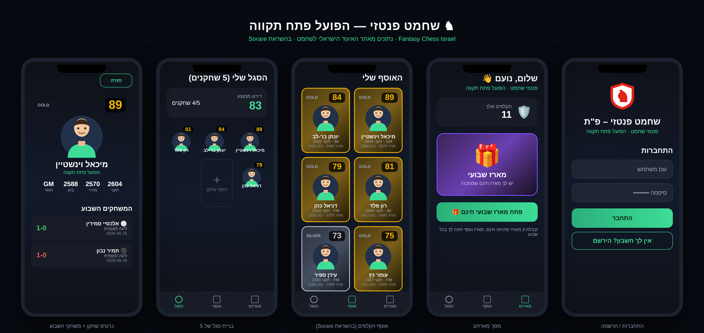

# שחמט פנטזי — הפועל פתח תקווה · Fantasy Chess Israel

A Sorare-inspired **fantasy chess game** for the players of **Hapoel Petah Tikva
(הפועל פתח תקווה)**, built as a native **Android app in Java**. Player data comes from the
**Israeli Chess Federation** site (אתר האיגוד הישראלי לשחמט, `chess.org.il`).



## Gameplay

- **Register / login** with a local account (passwords hashed with PBKDF2).
- Get **3 free starter packs** on first login and **1 free pack every week**.
- Each pack reveals player **cards** drawn with Sorare-style scarcity (top GMs are rare).
- **You must own a player's card** to field him.
- Build a **squad of 5** players; the app shows your squad's average rating.
- Every player has a **1–100 card rating** derived from his national Israeli rating, a
  **tier** (Bronze / Silver / Gold / Special) frame, and a **boy/girl avatar**.
- Tap a card to see the player's **games during the week** (date, opponent, colour, result).

## Federation integration ("the API")

`chess.org.il` is an ASP.NET site with **no public JSON API**, so player data is read from the
HTML of `Players/Player.aspx?Id=…` using **OkHttp + Jsoup**
(`federation/FederationClient.java`, `federation/PlayerPageParser.java`). The Hapoel Petah Tikva
roster is defined by the player ids in the bundled snapshot
(`app/src/main/assets/petah_tikva_players.json`), which is also used as an **offline fallback** so
the app is always usable. When the device is online each player is refreshed from the live page.

> The federation page is Hebrew and its DOM can change; the parser is best-effort and is locked
> down by `PlayerPageParserTest` against a saved fixture. Adjust the selectors if the live markup
> differs.

### Rating mapping

`game/RatingMapper.java` maps a national rating (≈1000–2800) to **1–100** linearly
(`1000 → 1`, `2800 → 100`) and derives the card tier.

## Project layout

| Area | Path |
|------|------|
| Auth (login/register, PBKDF2, session) | `app/src/main/java/.../auth/` |
| Room DB, entities, DAOs, `Repository` | `app/src/main/java/.../data/` |
| Federation scraper + snapshot loader | `app/src/main/java/.../federation/` |
| Rating / packs / week logic | `app/src/main/java/.../game/` |
| Screens (cards, squad, packs, detail) | `app/src/main/java/.../ui/` |
| Layouts, drawables (avatars, card frames) | `app/src/main/res/` |
| Bundled roster snapshot | `app/src/main/assets/petah_tikva_players.json` |
| Unit tests | `app/src/test/` |

## Build & run

Open in **Android Studio** (or CLI), then:

```bash
./gradlew assembleDebug      # build the APK
./gradlew testDebugUnitTest  # run unit tests
```

Run on an emulator or device (min SDK 24). On first launch, register an account and your starter
packs open automatically.

## Tests

Pure-JVM unit tests cover the parts that carry the game logic:

- `RatingMapperTest` — the 1–100 mapping and tier thresholds.
- `PackServiceTest` — pack size and rarity weighting.
- `PlayerPageParserTest` — parsing a saved `Player.aspx` fixture into ratings + games.

## Design mock / screenshot

`design-mock/` contains an HTML rendering of the screens used to generate the screenshot above
(the build environment had no Android emulator). It reads the **same** snapshot JSON and the
**same** rating formula as the app:

```bash
cd design-mock && npm install playwright && node render.mjs
```

## Notes & limitations

- Local accounts are on-device only — swap `auth/` for a real backend (REST/Firebase) for
  multi-user play and leaderboards.
- The snapshot roster/ratings are sample values; live values replace them when `chess.org.il` is
  reachable from the device.
